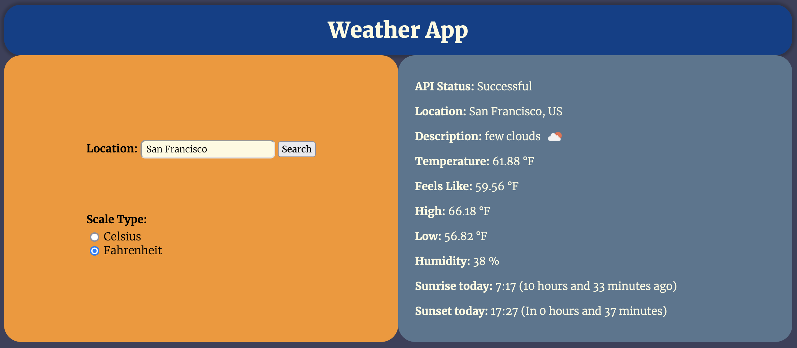

# Todo-List

Provides real-time weather information of user supplied location using the OpenWeather API

-><a href="https://sumedh-inamdar.github.io/weather-app/">link to page</a><-

## New lessons / material incorporated
- Asynchronous code and Promises
- Async and Await
- Working with APIs

## Pending tasks

## Future Features

## Bugs to Fix